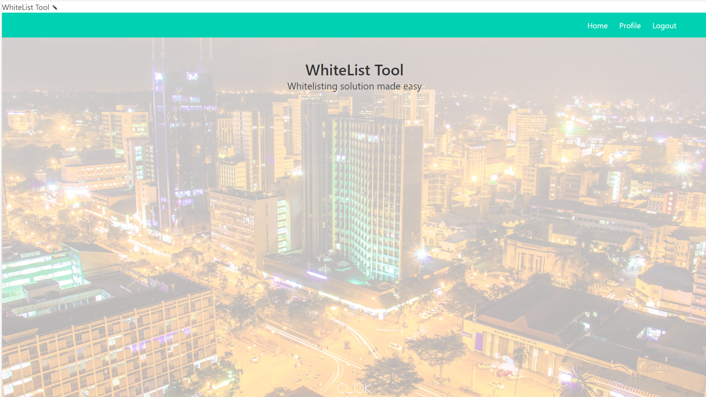

# WhiteList Tool

Welcome to my project! Here's some information about it:

## Introduction
[Project Link](https://github.com/annerachael/whitelist_tool)

[Blog Article](https://medium.com/@annerwenji/portfolio-project-blog-post-whitelist-tool-91d08c3e8db0)

[Author LinkedIn](https://www.linkedin.com/in/anne-waiyuyu-1a780516b/)

## Project Description

This project does something really cool.

## Features

- Adds New Users to the System
- Creates New Msisdns with the Service Line they would be whitelisted to.
- Deletes any msisdns not needed on the system.

## Installation

To get started with this project, follow these steps:

1. Clone the repository: `git clone git@github.com:annerachael/whitelist_tool.git`
2. Install dependencies: `pip install requirements.txt`
3. Run the project: `flask run`

## Usage

This tool is helpful for organization or enterprises with restricted 
services based on their customers' phonenumbers. 

## Contributing

If you'd like to contribute to this project, please check out our [Contribution Guidelines](contribution_guidelines.md).

## Licensing

This project is licensed under the [License Name](WhiteList_Tool).

## Preview

